# 📦 Simply Stock – Mobile Inventory Management App (Ongoing Development) 

The goal is to create a simple and easy-to-use mobile app that is free and scalable. This app would primarily help small businesses with tools like item creation, live inventory tracking, a checkout system, user authentication, role-based access, consumption analytics, and more.

---

## 🔐 Role-Based System

This application is built around two roles:

### 👨‍💼 Manager
Managers have full control over the inventory system:
- Create new items with descriptions, categories, and optional URLs  
- Upload images directly from the mobile device gallery when creating items  
- Add quantity to existing inventory (check-in system)  
- View consumption analytics based on employee activity  
- Delete existing user profiles  
- Navigate through managerial tools using a clean action bar
- Swap roles

When creating items, the app accesses the device’s gallery using Android’s built-in content picker. The selected image is stored as a URI and used throughout the app to visually represent each item.

---

### 👷 Employee
Employees interact with a live version of the inventory:
- View real-time inventory updates  
- Add items to a cart (only up to available quantity)  
- Adjust item quantities directly in the cart  
- Remove items if needed  
- Finalize checkout, which updates inventory and logs the transaction  

The cart acts as a temporary holding system. Items are not permanently changed until checkout is confirmed, ensuring accuracy and flexibility.

---

## 🗄️ Database Design (SQLite)

SQLite is used as the backbone of the system to manage all data:

- **Users Table** → stores user accounts  
- **Items Table** → stores inventory items  
- **Checkouts Table** → logs all transactions  
- **Organizations Table** → supports multiple businesses  

This structure allows:
- tracking who checked out what  
- when items were checked out  
- how much inventory remains  

---

## 📍 Multi-Location Support

The system was originally designed for a single location, but was improved to support multiple businesses (organizations). Each business has its own:
- inventory  
- employees  
- checkout records  

This makes the system scalable and usable across different environments.

---

## 🔒 Additional Features

- User authentication system  
- Password requirements for security  
- Logout functionality with activity reset  
- Manager-only access to sensitive features  
- Clean navigation using action bars  

---

## 📊 Consumption Analytics

Managers can:
- View users who have checked out items  
- Daily, weekly, and monthly analytics filtering
- Automatic date formatting based on the selected filter
- See a visual breakdown of item usage  

This feature uses a bar chart to display:
- item names  
- quantity checked out  

---

## 📈 AnyChart Integration

This was my first time using a third-party library from GitHub.

I used **AnyChart** to create the analytics graphs:
- Easy to integrate using documentation and YouTube tutorials  
- Pre-built chart structures made implementation straightforward  
- Built-in animations improved the overall user experience  

This was a great introduction to working with external libraries and understanding how to integrate them into an Android project.

---

## 🚀 Future Improvements

Planned features include:
- Camera integration for taking item photos directly  
- Low stock push notifications
- Cloud database support
- Barcode or QR code integration
- Improved UI/UX design and animations  
- Expanded admin controls
- Cross-platform/web support

---

## 🌱 Vision

The long-term goal is to keep this system:
- **simple**
- **scalable**
- **free for small businesses**

Simply Stock is currently in the Google Play Internal Testing phase and will continue receiving updates and improvements over time.

The GitHub repository will also continue to be updated with:
- new features
- screenshots
- bug fixes
- documentation
- Google Play deployment progress

Future goals include preparing the application for a full Google Play Store release.

---

## 🛠️ Tech Stack

- Java  
- Android Studio  
- SQLite  
- XML
- Google Play Console
- GitHub
- AnyChart

---

## 💭 Development Approach (FDD)

This project was developed using a **Feature-Driven Development (FDD)** approach.

- Focused on building small, manageable features  
- Followed a Gantt chart for planning  
- Adjusted timeline as needed  
- Allowed flexibility without strict time constraints  

Even though I have struggled with time management in the past, FDD helped me:
- stay organized  
- reduce stress  
- steadily build progress  

---

## 🏁 Final Thoughts

This project represents my first entry-level full stack mobile application.

From database design to UI, to implementing real-world features like carts, checkouts, role-based systems, and analytics — this was a major step forward in my development journey.

I’m proud of how far I’ve come with:
- problem solving  
- debugging  
- building a complete system from scratch  

And this is only the beginning.

---

## 📱 Application Screens

### Login & Authentication

  
  
  

<i>Login, account creation, and password reset workflow</i>

 

### Profile Management

  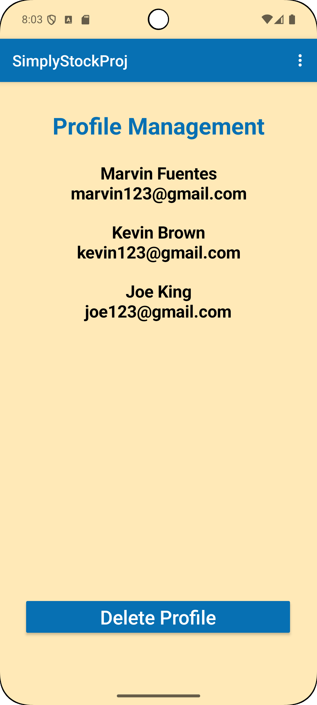
  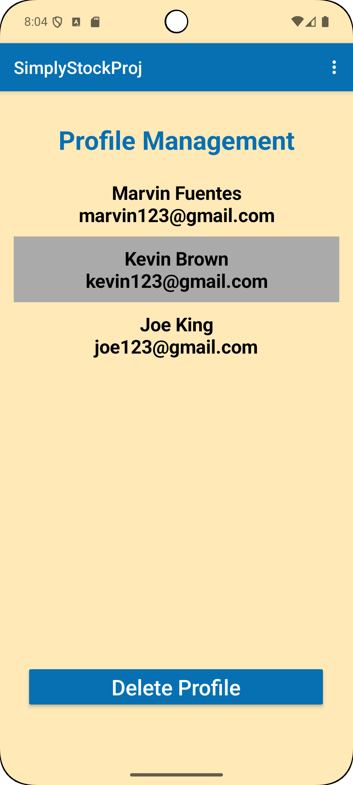
  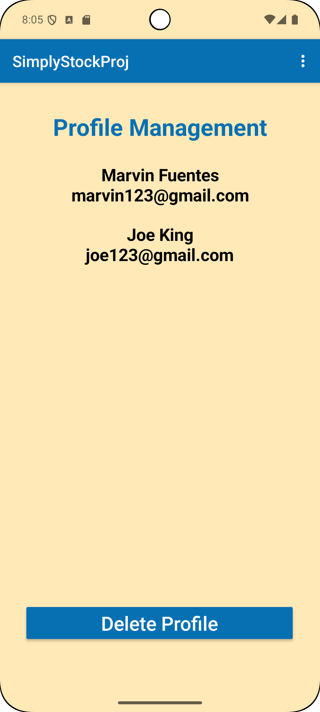

<i>List of profile accounts, selection grey background, deletion of account and automatic update.</i>

 

### Inventory System

  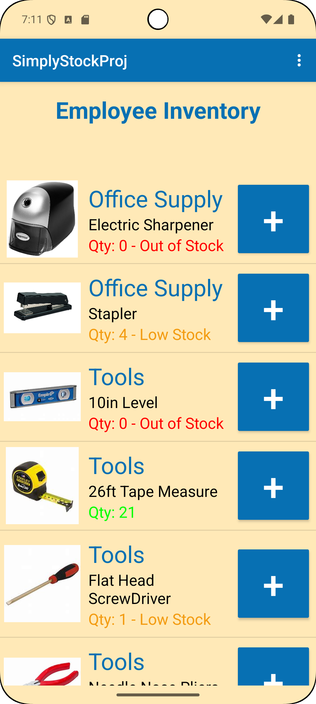
  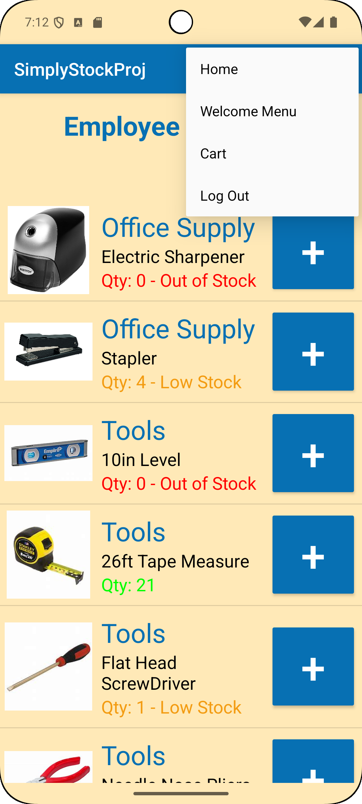
  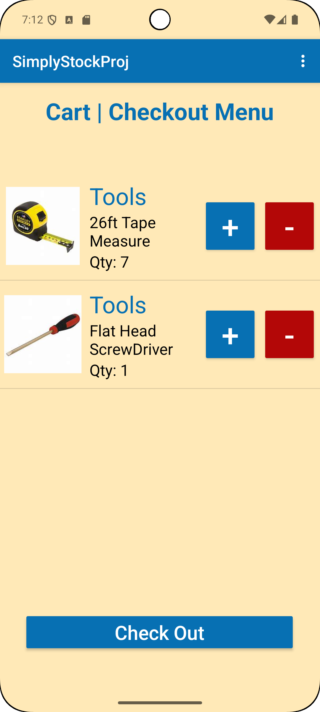

<i>Employee inventory view alphabetically ordered by category and low stock indicator, menu button with "Cart" button, and cart view / checkout System</i>

 

### Manager Tool Menu

  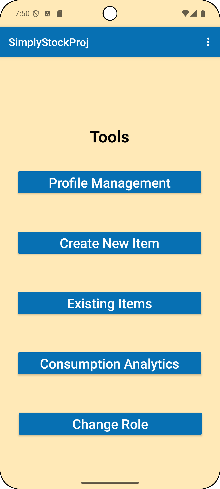

<i>Managers tool menu with multiple features such as profile management, item creation, existing items, Consumption Analytics, and Changing to Employee role.</i>

 

### Manager Feature - New Item

  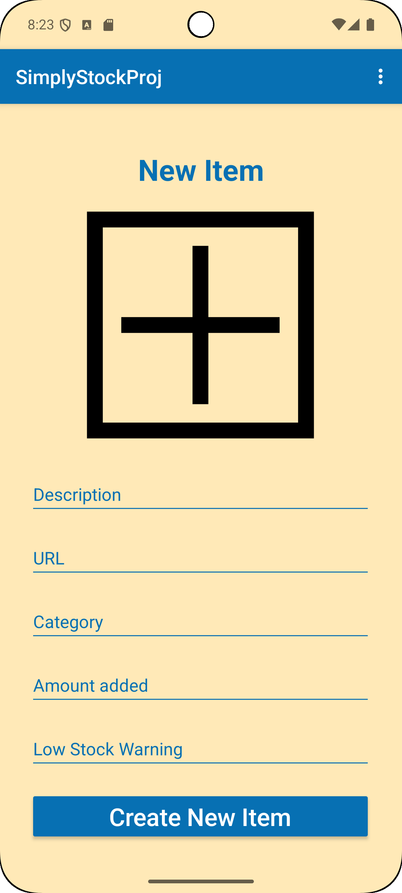

<i>New item with an individual los stock indicator instead of a universal low stock amount all items.</i>

 

### Manager Feature - Existing Items - Core Features

  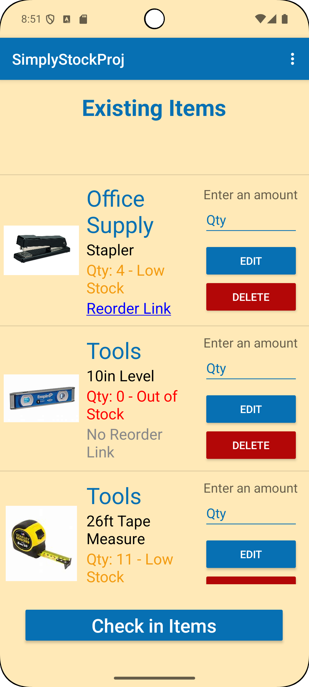
  
  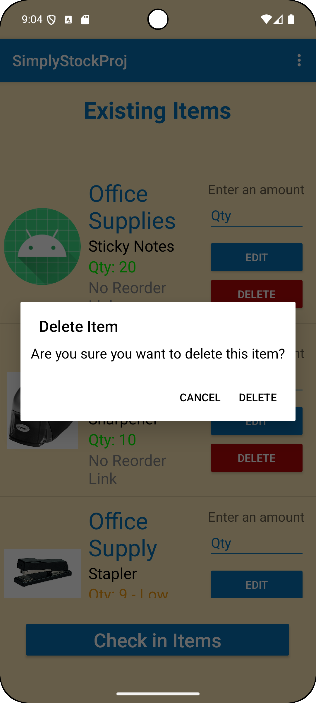

<i>List of existing items from inventory, Alert Dialog when editing an item with pre-filled data, Alert Dialog users receive when deleting an item.</i>

 

### Consumption Analytics

  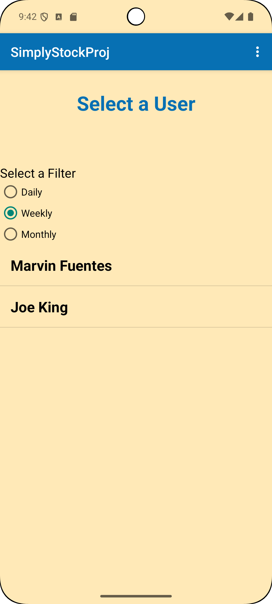
  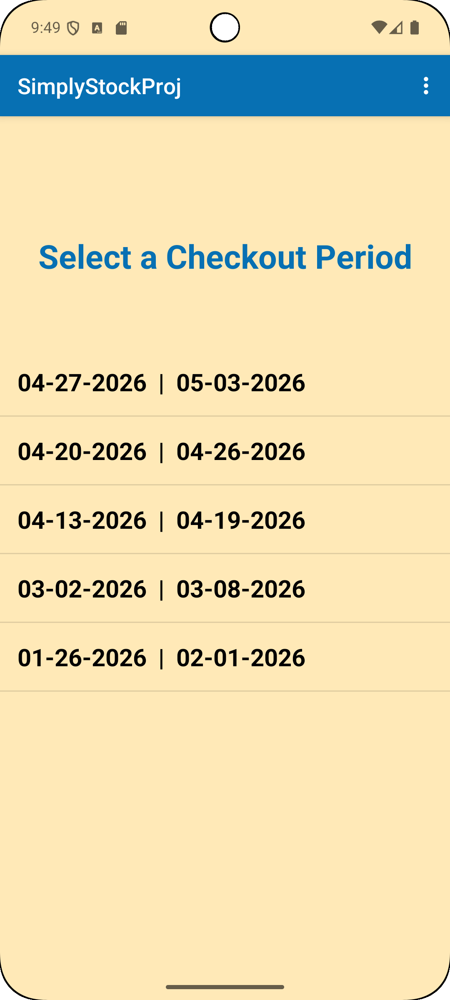
  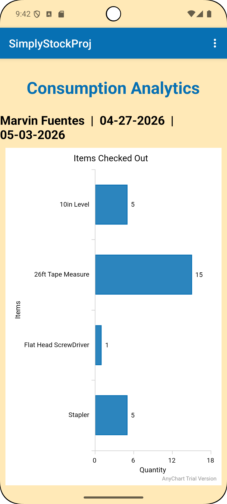

<i>Bar chart using AnyChart for consumption analytics</i>

 

### Business Selection/Business Creation

  
  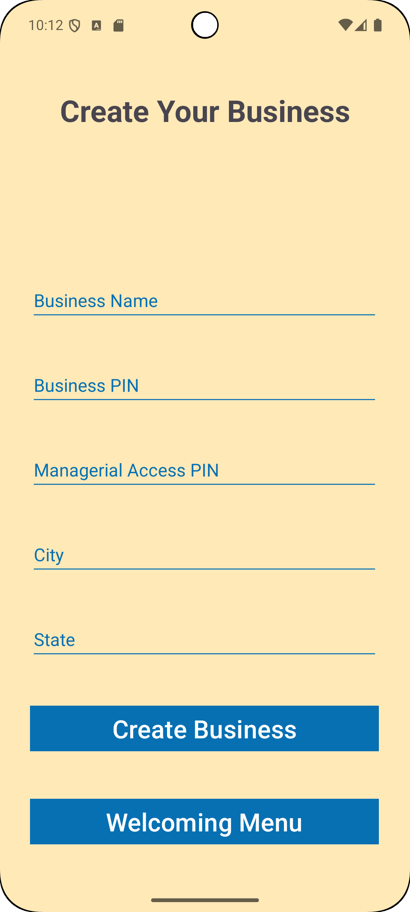

<i>Business selection and business creation process for new organizations.</i>

 
